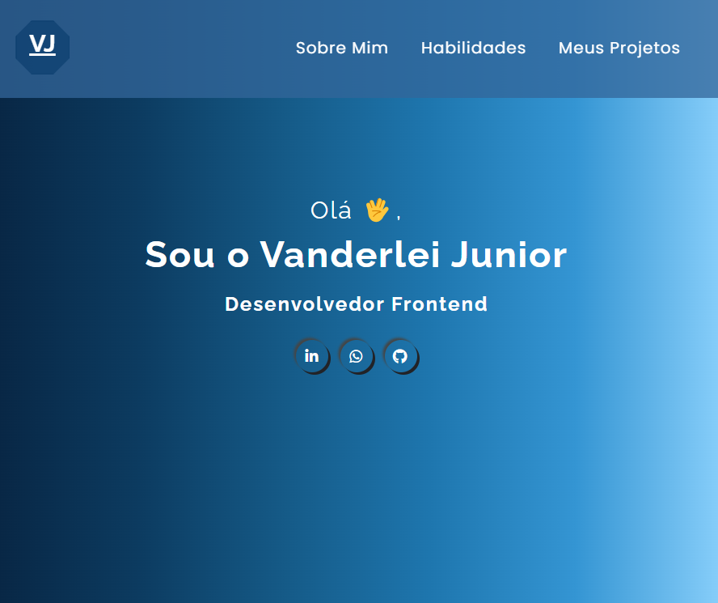

# My Development Portfolio

Welcome to my portfolio! Here you can find examples of the projects I have developed, highlighting my skills and progress in web development.

## Table of Contents
1. [About Me](#about-me)
2. [Skills](#skills)
3. [Projects](#projects)
4. [Contact](#contact)

## About Me
I am an early-career developer who is passionate about learning and facing new challenges. I constantly improve my knowledge of **HTML5**, **CSS3**, **JavaScript**, **Git**, and **GitHub**, aiming to create functional, responsive, and visually appealing projects.

Whenever necessary, I rely on trusted sources such as developer communities and Git repositories to solve problems and add value to my projects.

## Skills
Here are some of the technologies and tools I work with:
- **HTML5**: Building semantic structures for web pages.
- **CSS3**: Advanced styling with a focus on responsiveness and modern design.
- **JavaScript**: Currently learning and exploring its fundamental concepts.
- **Git and GitHub**: Version control and project collaboration.

## Projects

### [Portfolio](https://vanderlei94.github.io/portfolio/)

- **Description**: My first portfolio built only with HTML and CSS, showcasing my basic skills in this area.
- **Technologies**: HTML5, CSS3.
- 🔗 [View on GitHub Pages](https://vanderlei94.github.io/portfolio/)

---

### [Card NFT - Frontend Mentor](https://vanderlei94.github.io/preview-card-nft/)

- **Description**: A project that reinforces HTML and CSS skills with a focus on responsiveness. It uses pseudo-classes and pseudo-elements to improve hover effects.
- **Technologies**: HTML5, CSS3.
- 🔗 [View on GitHub Pages](https://vanderlei94.github.io/preview-card-nft/)

---

### [Agency Landing Page](https://vanderlei94.github.io/landing-page-com-grid-agencia/)

- **Description**: Demonstrates CSS and HTML skills, exploring animations without using JavaScript.
- **Technologies**: HTML5, CSS3.
- 🔗 [View on GitHub Pages](https://vanderlei94.github.io/landing-page-com-grid-agencia/)

---

### [Pokedev Pokédex](https://vanderlei94.github.io/projeto-pokedex/)

- **Description**: My first project created with HTML and CSS. This project inspired me to start studying programming more seriously.
- **Technologies**: HTML5, CSS3.
- 🔗 [View on GitHub Pages](https://vanderlei94.github.io/projeto-pokedex/)

## Contact
If you want to know more about my work or collaborate on a project, contact me:
- **Email**: [vanderleicas@icloud.com](mailto:vanderleicas@icloud.com)
- **LinkedIn**: [Vanderlei Junior](https://www.linkedin.com/in/vanderleidev/)
- **GitHub**: [Vanderlei94](https://github.com/Vanderlei94)
